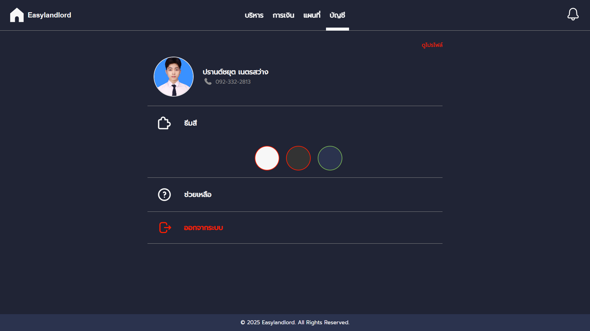

# Easylandlord

### What is [Easylandlord](https://easylandlord-e3923.web.app/)?
**Easylandlord** is a web application designed to manage and organize rental and real estate information efficiently. It allows users to store and access key details such as:
- Rental Information
- Tenant Contracts
- Financial History

The platform also includes helpful features like:
- Interactive Rental Map
- Rental Sharing
- Advanced Filtering Options

To accommodate different user preferences, Easylandlord offers three distinct themes and responsive for all IOS, enhancing usability and user experience.

*🗣 Note: The platform currently supports the Thai language only, including client agreements.*  
----------- Click here to use [Easylandlord](https://easylandlord-e3923.web.app/) ----------- 
 
 
 

### Used Language/Tools

  &nbsp;
  &nbsp;
  &nbsp;
  &nbsp;
  &nbsp;
  &nbsp;

   

### Website Interface

  
  
  
  
  
  

## License
This project is licensed under the MIT License — see the [LICENSE](LICENSE) file for details.
